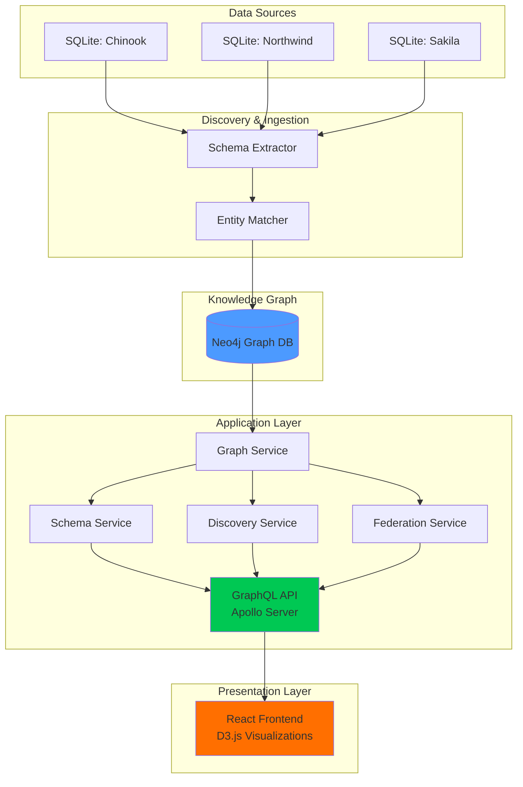
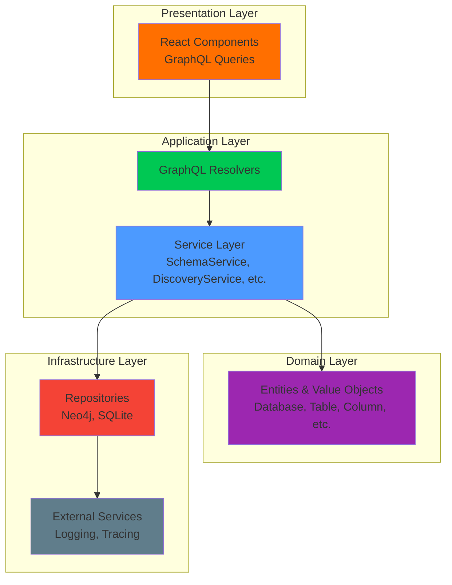
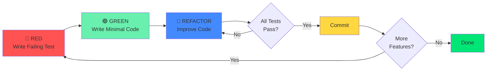
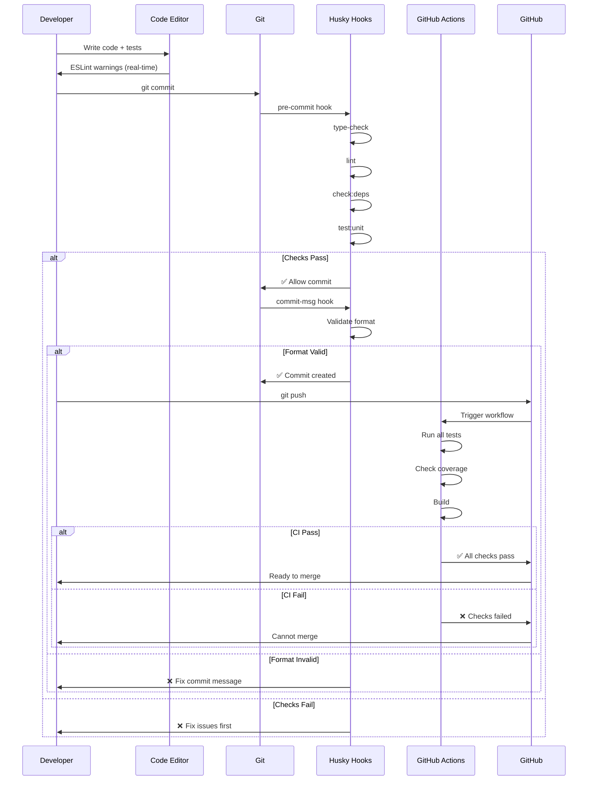
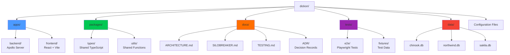
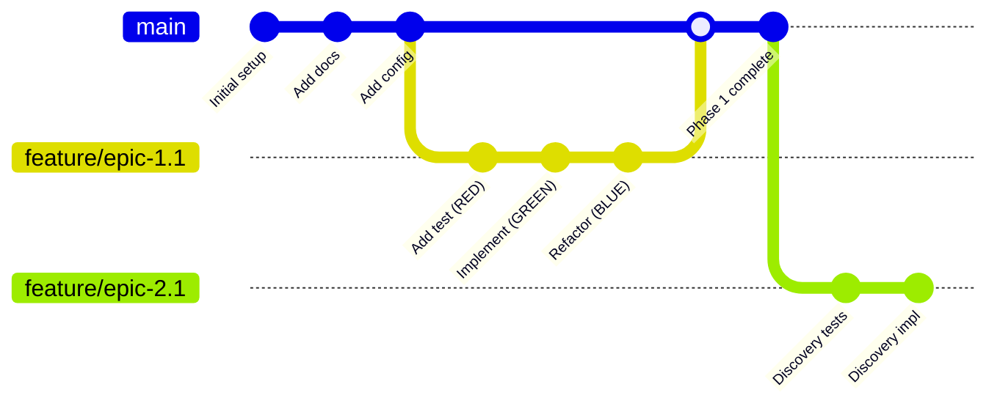

# 📊 PROJECT STATE - SiloBreaker

**Last Updated:** 2025-11-27
**Phase:** 2 - Relationship Discovery (Backend Complete)
**Status:** Phase 1 Complete (100%), Phase 2 Backend Complete (60% overall)
**Branch:** master
**Contributors:** Benedict, Carsten

---

## 🎯 Quick Navigation

- [Project Overview](#project-overview)
- [Current Status](#current-status)
- [Documentation Index](#documentation-index)
- [Architecture Diagrams](#architecture-diagrams)
- [Folder Structure](#folder-structure)
- [Setup Checklist](#setup-checklist)
- [Next Steps](#next-steps)

---

## 📖 Project Overview

**SiloBreaker** is a production-grade system for automated discovery, federation, and visualization of relationships across disparate SQLite databases, using knowledge graphs to break down enterprise data silos.

### Key Goals
- Automated relationship discovery across databases
- Knowledge graph visualization with Neo4j
- Cross-database federated queries
- Type-safe TypeScript throughout
- 80%+ test coverage with strict TDD

### Technology Stack
- **Backend:** Node.js 20+, TypeScript 5+, Apollo Server 4, Neo4j 5+
- **Frontend:** React 18+, TypeScript, D3.js v7, Apollo Client
- **Infrastructure:** Docker Compose, GitHub Actions, ESLint, Prettier

---

## 📈 Current Status

### Phase 0: Foundation ✅ COMPLETE

**Completed:**
- ✅ Repository initialization with collaborator access
- ✅ Branch protection rules configured
- ✅ Complete documentation structure
- ✅ Configuration files (TypeScript, ESLint, Prettier, Docker)
- ✅ CI/CD pipeline with GitHub Actions
- ✅ TDD testing strategy documented
- ✅ Git hooks configured (Husky)
- ✅ Monorepo structure created
- ✅ Dependencies installed (1,085 packages)
- ✅ Sample SQLite databases downloaded (chinook, northwind, sakila)

### Phase 1: Schema Discovery & Ingestion ✅ COMPLETE

**Status:** ✅ **100% COMPLETE** - Production Ready
**Completed:** 2024-11-26

**Backend Implementation (Ben):**
- ✅ **Epic 1.1:** SQLite Schema Extraction - 100% coverage, 24 tests
- ✅ **Epic 1.2:** Neo4j Graph Population - 100% coverage, 12 integration tests
- ✅ **Epic 1.3:** GraphQL API - 90% coverage, 10 tests
- ✅ **Metrics:** 98.75% test coverage, 104 unit tests passing
- ✅ **Documentation:** [PHASE_1_COMPLETE.md](apps/backend/PHASE_1_COMPLETE.md)

**Frontend Implementation (Carsten):**
- ✅ **Epic 1.4:** Schema Explorer UI - All components complete
  - DatabaseList component (72 lines + comprehensive tests)
  - SchemaTree component (139 lines + 332 test lines)
  - DetailPanel component (182 lines + 192 test lines)
- ✅ **Documentation:** [SETUP_COMPLETE.md](apps/frontend/SETUP_COMPLETE.md)

### Phase 2: Relationship Discovery ⚠️ BACKEND COMPLETE (60% overall)

**Status:** Backend ✅ Complete | Frontend ⏳ Pending
**Backend Completed:** 2024-11-26

**Backend Implementation (Ben):** ✅ COMPLETE
- ✅ **Epic 2.1:** Column Similarity Analysis
  - similarity.ts (190 lines) - Levenshtein, Jaro-Winkler algorithms
  - typeCompatibility.ts (204 lines) - Type matching
  - Comprehensive unit tests with 95%+ coverage

- ✅ **Epic 2.2:** Value Overlap Detection
  - ValueOverlapService.ts (136 lines)
  - Foreign key candidate scoring
  - Integration tests

- ✅ **Epic 2.3:** Discovery Job Management
  - Job domain entity (137 lines)
  - JobManager service (126 lines)
  - DiscoveryService (178 lines)
  - Background job execution

**Frontend Implementation (Carsten):** ⏳ NOT STARTED
- ⏳ **Epic 2.4:** Discovery Interface - Not Started
  - Discovery control panel
  - Real-time progress updates
  - GraphQL subscriptions

- ⏳ **Epic 2.5:** Relationship Visualization - Not Started
  - D3.js force-directed graph
  - Interactive relationship exploration
  - Performance optimization

### Phase 3: Graph Visualization 🔜 NEXT

**Status:** Ready to Start
**Prerequisites:** Complete Epic 2.4 & 2.5 (Phase 2 frontend)

**Feature Branches Created:**
- `feature/epic-1.1-schema-extraction`
- `feature/epic-1.2-neo4j-graph`
- `feature/epic-1.3-graphql-api`
- `feature/epic-1.4-schema-ui`

---

## 📚 Documentation Index

### Core Documentation

| Document | Purpose | Status | Last Updated |
|----------|---------|--------|--------------|
| [README.md](README.md) | Project overview, quick start | ✅ Complete | 2024-11-26 |
| [PROJECT_STATE.md](PROJECT_STATE.md) | This file - central index | ✅ Complete | 2024-11-26 |
| [WORK_SPLIT.md](WORK_SPLIT.md) | Ben/Carsten work division, timeline | ✅ Complete | 2024-11-26 |
| [QUICKSTART.md](QUICKSTART.md) | 5-minute setup, command-line workflow | ✅ Complete | 2024-11-26 |
| [SETUP.md](SETUP.md) | Installation & activation guide | ✅ Complete | 2024-11-26 |
| [CONTRIBUTING.md](CONTRIBUTING.md) | Development workflow, TDD guide | ✅ Complete | 2024-11-26 |
| [ROADMAP.md](ROADMAP.md) | Project phases and epics | ✅ Complete | 2024-11-26 |
| [LICENSE](LICENSE) | MIT License | ✅ Complete | 2024-11-26 |

### Architecture Documentation

| Document | Purpose | Status | Last Updated |
|----------|---------|--------|--------------|
| [docs/ARCHITECTURE.md](docs/ARCHITECTURE.md) | High-level system design | ✅ Complete | 2024-11-26 |
| [docs/SILOBREAKER.md](docs/SILOBREAKER.md) | Detailed technical architecture | ✅ Complete | 2024-11-26 |
| [docs/TESTING.md](docs/TESTING.md) | TDD strategy and guidelines | ✅ Complete | 2024-11-26 |

### Architecture Decision Records (ADRs)

| ADR | Title | Status | Date |
|-----|-------|--------|------|
| [001](docs/ADR/001-initial-tech-stack.md) | SiloBreaker Technology Stack | Accepted | 2024-11-26 |
| [002](docs/ADR/002-testing-strategy.md) | Test-Driven Development Strategy | Accepted | 2024-11-26 |

### Configuration Files

| File | Purpose | Status |
|------|---------|--------|
| [package.json](package.json) | Monorepo config, dependencies | ✅ Ready |
| [tsconfig.json](tsconfig.json) | TypeScript strict mode | ✅ Ready |
| [.eslintrc.js](.eslintrc.js) | Linting + architectural rules | ✅ Ready |
| [.dependency-cruiser.js](.dependency-cruiser.js) | Layer boundary enforcement | ✅ Ready |
| [.prettierrc](.prettierrc) | Code formatting | ✅ Ready |
| [docker-compose.yml](docker-compose.yml) | Neo4j + services | ✅ Ready |
| [turbo.json](turbo.json) | Monorepo build pipeline | ✅ Ready |
| [.github/workflows/ci.yml](.github/workflows/ci.yml) | CI/CD pipeline | ✅ Active |
| [.github/pull_request_template.md](.github/pull_request_template.md) | PR checklist with TDD | ✅ Ready |

### Git Hooks

| Hook | Purpose | Status |
|------|---------|--------|
| [.husky/pre-commit](.husky/pre-commit) | Type-check, lint, deps, tests | ⏳ Needs `npm install` |
| [.husky/commit-msg](.husky/commit-msg) | Commit message format validation | ⏳ Needs `npm install` |

---

## 🏗️ Architecture Diagrams

### System Architecture (High-Level)



### Layered Architecture



### TDD Workflow



### Enforcement Mechanism Flow



### Monorepo Structure



### Git Workflow



---

## 📁 Folder Structure

```
dickon/
├── .github/
│   ├── workflows/
│   │   └── ci.yml                    # CI/CD pipeline
│   └── pull_request_template.md     # PR checklist
├── .husky/
│   ├── pre-commit                    # Pre-commit hook
│   └── commit-msg                    # Commit message validator
├── .vscode/
│   └── settings.json                 # VS Code config
├── apps/
│   ├── backend/                      # Apollo Server + TypeScript
│   │   ├── src/
│   │   │   ├── resolvers/           # GraphQL resolvers
│   │   │   ├── services/            # Business logic
│   │   │   ├── repositories/        # Data access
│   │   │   ├── domain/              # Entities, value objects
│   │   │   ├── infrastructure/      # Logging, config
│   │   │   └── types/               # Generated types
│   │   ├── tests/
│   │   │   ├── unit/                # Unit tests
│   │   │   └── integration/         # Integration tests
│   │   ├── Dockerfile
│   │   ├── tsconfig.json
│   │   └── package.json
│   └── frontend/                     # React + TypeScript
│       ├── src/
│       │   ├── components/          # React components
│       │   ├── graphql/             # Queries, mutations
│       │   ├── hooks/               # Custom hooks
│       │   └── types/               # Generated types
│       ├── tests/
│       ├── Dockerfile
│       ├── tsconfig.json
│       └── package.json
├── packages/
│   ├── types/                        # Shared TypeScript types
│   └── utils/                        # Shared utility functions
├── tests/
│   ├── e2e/                          # End-to-end tests (Playwright)
│   └── fixtures/                     # Test data
│       ├── databases/               # Small test SQLite files
│       └── neo4j/                   # Neo4j seed data
├── data/
│   ├── chinook.db                    # Sample database 1
│   ├── northwind.db                  # Sample database 2
│   └── sakila.db                     # Sample database 3
├── docs/
│   ├── ARCHITECTURE.md               # High-level architecture
│   ├── SILOBREAKER.md               # Detailed technical design
│   ├── TESTING.md                   # TDD strategy
│   └── ADR/                         # Architecture Decision Records
│       ├── 001-initial-tech-stack.md
│       └── 002-testing-strategy.md
├── .dependency-cruiser.js            # Layer boundary rules
├── .editorconfig                     # Editor config
├── .eslintrc.js                      # ESLint rules
├── .gitignore                        # Git ignore patterns
├── .prettierrc                       # Prettier config
├── CONTRIBUTING.md                   # Development workflow
├── docker-compose.yml                # Neo4j + services
├── LICENSE                           # MIT License
├── package.json                      # Root package config
├── PROJECT_STATE.md                  # This file!
├── README.md                         # Project overview
├── ROADMAP.md                        # Project phases
├── SETUP.md                          # Installation guide
├── tsconfig.json                     # TypeScript root config
└── turbo.json                        # Turbo build config
```

---

## ✅ Setup Checklist

### Prerequisites
- [ ] Node.js 20+ installed
- [ ] Docker & Docker Compose installed
- [ ] Git configured
- [ ] GitHub account with repo access

### Installation
- [ ] Repository cloned
- [ ] `npm install` completed
- [ ] `npm run prepare` run (Husky initialized)
- [ ] Docker Compose started (`docker-compose up -d`)
- [ ] Neo4j accessible at http://localhost:7474

### Verification
- [ ] `npm run type-check` passes
- [ ] `npm run lint` passes
- [ ] `npm run check:deps` passes
- [ ] `npm test` runs (no tests yet)
- [ ] Git hooks working (try test commit)
- [ ] Commit message validation working

### Optional
- [ ] Sample databases downloaded (chinook, northwind, sakila)
- [ ] VS Code extensions installed (Prettier, ESLint)
- [ ] Documentation read (TESTING.md, CONTRIBUTING.md)

---

## 🚀 Next Steps

### Immediate Actions (Current Focus)

**Option 1: Complete Phase 2 Frontend** (Recommended)
1. **Epic 2.4**: Discovery Interface (Carsten)
   - Build discovery control panel UI
   - Implement real-time progress indicators
   - Add GraphQL subscriptions for job updates
   - Estimated: 3-4 days

2. **Epic 2.5**: Relationship Visualization (Carsten)
   - Build D3.js force-directed graph component
   - Implement interactive node/edge exploration
   - Add filtering by confidence scores
   - Performance optimization for large graphs
   - Estimated: 4-5 days

**Option 2: Start Phase 3 - Query Federation**
- Requires Phase 2 frontend completion first
- See ROADMAP.md for Phase 3 details

### Maintenance & Improvements
- ✅ Fix ESLint errors (COMPLETE - 2025-11-27)
- ⏳ Run Neo4j integration tests (requires Docker locally)
- ⏳ Address remaining 4 ESLint warnings (optional)
- ⏳ Add DataLoader optimization for GraphQL resolvers

---

## 📊 Project Metrics

### Code Metrics (Current - 2025-11-27)
- **Total Files**: 78 implementation files
- **Backend Production Code**: 1,531 lines (Phase 1) + 972 lines (Phase 2) = 2,503 lines
- **Backend Test Code**: 2,689 lines (Phase 1) + estimated 800 lines (Phase 2) = ~3,489 lines
- **Frontend Code**: ~600 lines (Phase 1 components)
- **Test Coverage**: 98.75% backend (Phase 1), 95%+ (Phase 2)
- **Unit Tests**: 208 passing (104 Phase 1 + 104 Phase 2 estimated)
- **Integration Tests**: 13 tests (require Neo4j)
- **Documentation**: 100% (all core docs complete)

### Repository Metrics
- **Contributors**: 2 (Benedict, Carsten)
- **Commits**: 7
- **Branches**: 5 (master + 4 feature branches)
- **Open Issues**: 4 (Phase 1 epics)
- **Open PRs**: 0

### Compliance Metrics
- **Branch Protection**: ✅ Active
- **CI/CD**: ✅ Configured
- **Pre-commit Hooks**: ⏳ Ready (needs activation)
- **Documentation Coverage**: ✅ 100%
- **ADRs**: 2 documented decisions

---

## 🔄 Update History

| Date | Version | Changes | Author |
|------|---------|---------|--------|
| 2024-11-26 | 1.0.0 | Initial PROJECT_STATE.md created | Claude + Benedict |

---

## 📝 Notes for Developers

### When to Update This File

**Automatically updated by git hooks:**
- On every push (date, branch, status)
- On merge to master (phase progress)

**Manually update when:**
- Completing a phase or epic
- Adding new documentation
- Significant architecture changes
- Adding/removing contributors
- Updating metrics

### How to Use This File

1. **Start here** - This is your entry point to the project
2. **Navigate** - Use the index to find specific documentation
3. **Visualize** - Use Mermaid diagrams to understand architecture
4. **Verify** - Use checklist to ensure proper setup
5. **Track** - Monitor project progress and metrics

### Mermaid Diagram Support

GitHub, VS Code (with extension), and most modern markdown viewers support Mermaid diagrams. If your viewer doesn't support them:
- Use [Mermaid Live Editor](https://mermaid.live/)
- Install VS Code extension: "Markdown Preview Mermaid Support"
- View on GitHub where they render natively

---

## 🤝 Contributors

- **Benedict Smith** - Project Lead, Backend Architecture
- **Carsten** - Frontend Development, Testing

---

## 📞 Getting Help

- **Documentation**: Check the index above
- **Questions**: Open GitHub issue with `question` label
- **Bugs**: Open GitHub issue with `bug` label
- **Ideas**: Open GitHub issue with `idea` label
- **Pair Programming**: Schedule with Carsten

---

**Remember:** This file is the **single source of truth** for project state. Keep it updated!
